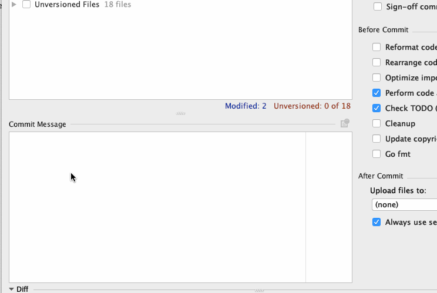

# Emoji Support Plugin

Intellij plugin for supporting auto-complete for Emoji. This plugin heavily rely on <a href="https://github.com/WebpageFX/emoji-cheat-sheet.com">emoji-cheat-sheet.com</a>

This plugin is useful for filling in Emoji for commit messages and markdown.

## How to use it?

* Open Commit Changes dialog
* Open code completion



## emoji-cheat-sheet.com

First of all, I would like to say thanks for all works on [emoji-cheat-sheet.com](https://github.com/WebpageFX/emoji-cheat-sheet.com)

Their license of Emoji icons is under following term.

```
All emoji images (unless listed below) are Copyright (c) 2012 Apple Inc. All rights reserved.

octocat, squirrel, shipit
Copyright (c) 2012 GitHub Inc. All rights reserved.

bowtie
Copyright (c) 2012 37signals, LLC. All rights reserved.

neckbeard
Copyright (c) 2012 Jamie Dihiansan. Creative Commons Attribution 3.0 Unported

feelsgood, finnadie, goberserk, godmode, hurtrealbad, rage 1, rage 2, rage 3, rage 4, suspect
Copyright (c) 2012 id Software. All rights reserved.

trollface
Copyright (c) 2012 whynne@deviantart. All rights reserved.
```

If this plugin violate this term, I will remove all their icons.

## Emoji Support Plugin's License

Except those icons from [emoji-cheat-sheet.com](https://github.com/WebpageFX/emoji-cheat-sheet.com), this plugin is under following term.

```
Copyright 2017 Yoshinori Isogai

Licensed under the Apache License, Version 2.0 (the "License");
you may not use this file except in compliance with the License.
You may obtain a copy of the License at

   http://www.apache.org/licenses/LICENSE-2.0

Unless required by applicable law or agreed to in writing, software
distributed under the License is distributed on an "AS IS" BASIS,
WITHOUT WARRANTIES OR CONDITIONS OF ANY KIND, either express or implied.
See the License for the specific language governing permissions and
limitations under the License.
```
