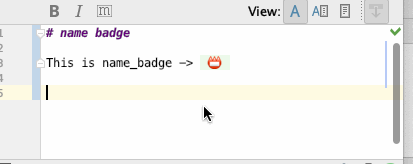

[](https://github.com/shiraji/find-pull-request/blob/master/LICENSE)
[](https://plugins.jetbrains.com/plugin/9174-emoji-support-plugin)
[](https://plugins.jetbrains.com/plugin/9174-emoji-support-plugin)


# Emoji Support Plugin

Intellij plugin for supporting auto-complete for Emoji. This plugin is useful for filling in Emoji for commit messages.

## How to use it?

1. Type ":" and emoji name
1. Open code completion


## Code Folding

This plugin provides code folding for emoji.



## Supported inserting location

* IntelliJ Commit Message

The list of supported languages are:

* Markdown

See [#20](https://github.com/shiraji/emoji/issues/20) for other languages

## How to install

Use the IDE's plugin manager to install the latest version of the plugin.

## LICENSE

```
Copyright 2020 Yoshinori Isogai

Licensed under the Apache License, Version 2.0 (the "License");
you may not use this file except in compliance with the License.
You may obtain a copy of the License at

   http://www.apache.org/licenses/LICENSE-2.0

Unless required by applicable law or agreed to in writing, software
distributed under the License is distributed on an "AS IS" BASIS,
WITHOUT WARRANTIES OR CONDITIONS OF ANY KIND, either express or implied.
See the License for the specific language governing permissions and
limitations under the License.
```
